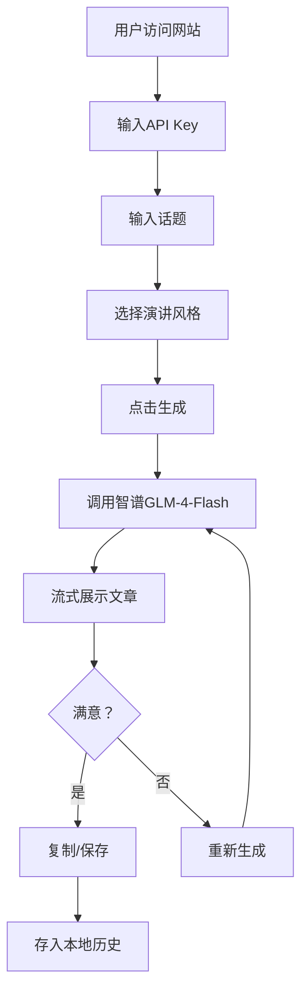

# 产品需求文档 (PRD) — 即兴说·Impromptu

## 1. 产品概述
一款基于智谱GLM-4-Flash模型的AI文章生成器，采用最前沿的"去AI味"Prompt工程，让生成的文章口吻完全像即兴演讲——自然、有停顿、有情绪波动、有个人色彩，毫无AI痕迹。部署在GitHub Pages，手机电脑通用。

- 核心问题：AI生成的文章千篇一律、腔调生硬、结构模板化，一眼就能看出是AI写的
- 目标用户：内容创作者、自媒体人、演讲稿撰写者、需要"人味"文字的任何人
- 产品价值：让AI写出真正像人说的、像即兴发挥的文字

## 2. 核心功能

### 2.1 用户角色
| 角色 | 注册方式 | 核心权限 |
|------|----------|----------|
| 访客 | 无需注册 | 输入API Key后使用全部功能 |

### 2.2 功能模块
1. **主页面**：品牌Hero区、话题输入区、风格选择区、生成文章展示区、历史记录区

### 2.3 页面详情
| 页面名称 | 模块名称 | 功能描述 |
|----------|----------|----------|
| 主页面 | Hero品牌区 | 品牌名"即兴说"、标语、动态背景效果 |
| 主页面 | API Key配置 | 输入智谱API Key，本地存储，不外传 |
| 主页面 | 话题输入区 | 输入想聊的话题/主题，支持自由文本 |
| 主页面 | 风格选择 | 演讲风格：脱口秀/TED演讲/播客闲聊/课堂讲授/朋友聊天 |
| 主页面 | 文章生成展示 | 流式输出文章，打字机效果，支持复制/重新生成 |
| 主页面 | 历史记录 | 本地存储生成历史，可回顾/删除 |

## 3. 核心流程

用户打开网站 → 输入智谱API Key → 输入话题 → 选择演讲风格 → 点击生成 → 流式展示文章 → 复制/重新生成/查看历史

## 4. 用户界面设计

### 4.1 设计风格
- **主色调**：深墨色(#0a0a0f) + 暖橙accent(#ff6b35) + 米白文字(#f5f0e8)
- **风格**：演讲台/聚光灯感——暗色背景配聚光效果，像站在舞台上即兴发挥
- **字体**：标题用"Playfair Display"（演讲感/古典感），正文用"Noto Serif SC"（中文衬线/人文感）
- **布局**：单页纵向流式，卡片式模块，居中聚焦
- **图标**：Lucide图标，麦克风/演讲相关
- **动画**：打字机效果输出文字、聚光灯微动效、按钮hover发光

### 4.2 页面设计概览
| 页面名称 | 模块名称 | UI元素 |
|----------|----------|--------|
| 主页面 | Hero品牌区 | 大标题"即兴说"、副标题、聚光灯背景动效、麦克风图标 |
| 主页面 | API Key配置 | 密码输入框+保存按钮、本地存储提示 |
| 主页面 | 话题输入区 | 大文本框、placeholder引导语 |
| 主页面 | 风格选择 | 5个风格卡片，选中高亮+发光边框 |
| 主页面 | 文章展示区 | 深色卡片、打字机流式输出、复制按钮、重新生成按钮 |
| 主页面 | 历史记录 | 侧边抽屉/底部折叠、时间+话题摘要、点击展开 |

### 4.3 响应式设计
- 桌面端（≥1024px）：居中宽版布局，左右留白，风格卡片横排
- 平板端（768-1023px）：适度收窄，风格卡片2+3排列
- 手机端（<768px）：全宽布局，风格卡片纵排，历史记录底部折叠

### 4.4 独立标题与图标
- 网站标题：即兴说 · Impromptu
- Favicon：麦克风+声波SVG图标
- 页面title：即兴说 — 让AI像人一样说话
