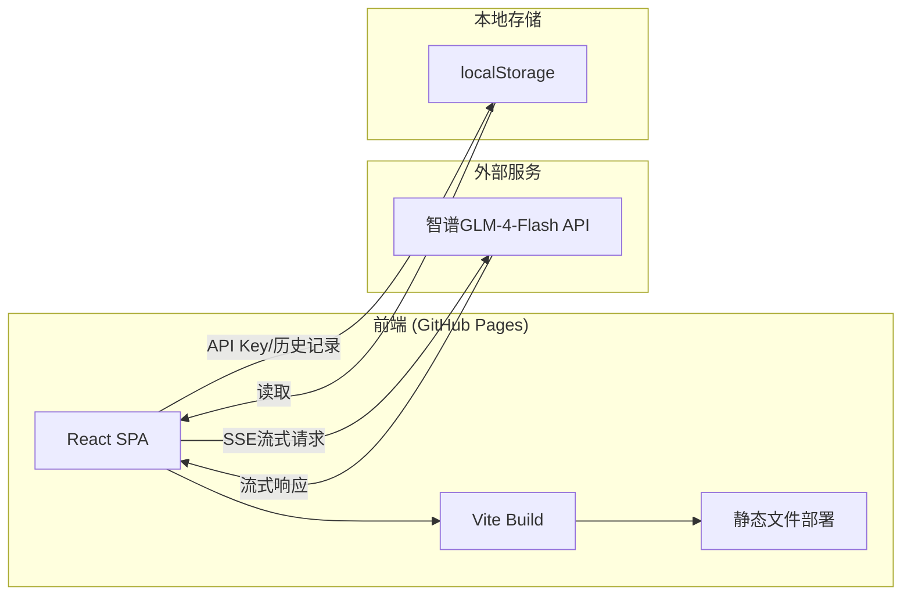

# 技术架构文档 — 即兴说·Impromptu

## 1. 架构设计



纯前端架构，无后端。直接从浏览器调用智谱GLM-4-Flash API，API Key存储在用户浏览器localStorage中。

## 2. 技术说明
- **前端**：React@18 + TypeScript + Tailwind CSS + Vite
- **初始化工具**：vite-init (react-ts模板)
- **后端**：无
- **数据库**：无（使用localStorage存储）
- **API**：智谱GLM-4-Flash（通过fetch直接调用，SSE流式响应）
- **部署**：GitHub Pages（vite build → 静态文件）

## 3. 路由定义
| 路由 | 用途 |
|------|------|
| / | 主页面（单页应用，所有功能集成） |

## 4. API定义

### 4.1 智谱GLM-4-Flash API调用
- **端点**：`https://open.bigmodel.cn/api/paas/v4/chat/completions`
- **方法**：POST
- **认证**：Bearer Token（用户提供的API Key）
- **请求体**：
```typescript
interface ChatRequest {
  model: "glm-4-flash";
  messages: Array<{role: string; content: string}>;
  stream: true;
  temperature: number; // 0.8-1.2 增加随机性
  top_p: number; // 0.9
}
```
- **响应**：SSE流式响应，逐token返回

### 4.2 核心"去AI味"Prompt设计
系统Prompt采用多层约束策略：
1. **身份锚定**：设定为特定性格的真实人物，而非AI助手
2. **语言约束**：禁止AI高频词汇（"总之"、"值得注意的是"、"首先其次最后"等）
3. **结构约束**：禁止三段论、总分总结构，要求意识流/跳跃式思维
4. **语气注入**：加入口语化标记（"嗯"、"说实话"、"你猜怎么着"）
5. **不完美模拟**：刻意加入自我纠正、跑题再拉回、犹豫停顿
6. **情感波动**：要求情绪起伏，而非平铺直叙
7. **个人经验**：编造具体的生活细节和个人经历
8. **即兴感**：模拟即兴演讲的松散结构和意外转折

## 5. 数据模型

### 5.1 localStorage数据结构
```typescript
interface HistoryItem {
  id: string;
  topic: string;
  style: string;
  content: string;
  createdAt: number;
}

interface AppConfig {
  apiKey: string;
}
```

### 5.2 状态管理 (Zustand)
```typescript
interface AppStore {
  apiKey: string;
  setApiKey: (key: string) => void;
  currentTopic: string;
  setCurrentTopic: (topic: string) => void;
  currentStyle: string;
  setCurrentStyle: (style: string) => void;
  generatedContent: string;
  setGeneratedContent: (content: string) => void;
  isGenerating: boolean;
  setIsGenerating: (val: boolean) => void;
  history: HistoryItem[];
  addHistory: (item: HistoryItem) => void;
  removeHistory: (id: string) => void;
}
```

## 6. GitHub Pages部署配置
- `vite.config.ts`中设置`base`为仓库名
- 添加`.github/workflows/deploy.yml`用于自动部署
- `package.json`中添加`deploy`脚本使用`gh-pages`包
